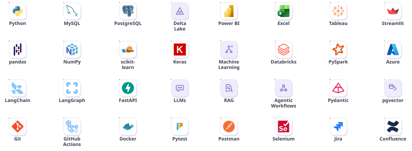
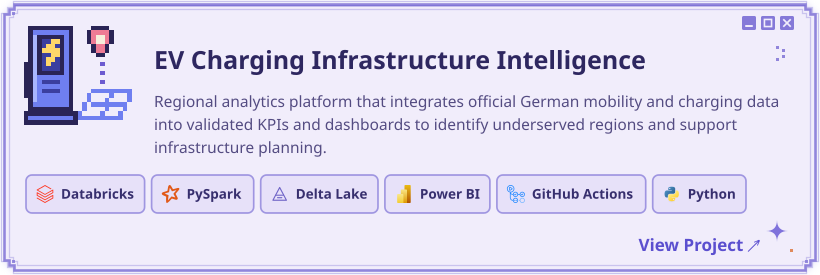
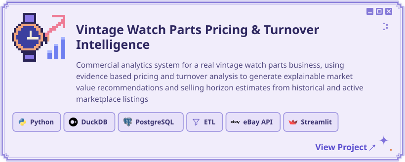
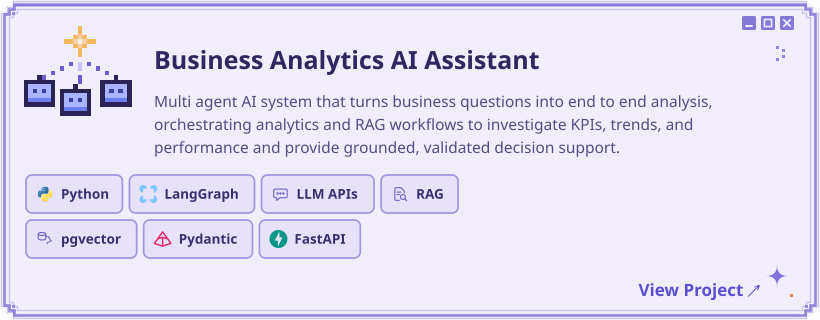
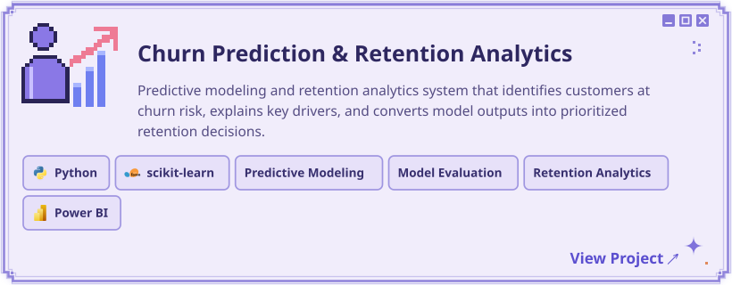

  

## ✦ About Me

<picture><source media="(prefers-color-scheme: dark)" srcset="./assets/profile/dark/about-gradcap.svg" /></picture>&nbsp; I'm pursuing an <b>M.Sc. in Data Analytics &amp; Decision Science at RWTH Aachen University.</b>

<picture><source media="(prefers-color-scheme: dark)" srcset="./assets/profile/dark/about-dashboard.svg" /></picture>&nbsp; I build <b>analytics platforms and intelligent systems</b> around real world problems, designed to provide a reliable analytical foundation for assessing risks, evaluating alternatives, and shaping well grounded business recommendations.

<picture><source media="(prefers-color-scheme: dark)" srcset="./assets/profile/dark/about-database.svg" /></picture>&nbsp; I also bring <b>2+ years of industry experience in QA Automation</b>, working with SQL systems, validation, and automation across production workflows.

<picture><source media="(prefers-color-scheme: dark)" srcset="./assets/profile/dark/about-briefcase.svg" /></picture>&nbsp; <b>Looking for internship and working student opportunities in Analytics, Data Science &amp; Applied AI.</b>

<h3 align="center">✦ Tech Stack</h3>

<picture>
<source media="(prefers-color-scheme: dark) and (max-width: 560px)" srcset="./assets/profile/dark/stack-board-mobile.svg" />
<source media="(max-width: 560px)" srcset="./assets/profile/light/stack-board-mobile.svg" />
<source media="(prefers-color-scheme: dark)" srcset="./assets/profile/dark/stack-board.svg" />

</picture>

 

<h3 align="center">✦ Featured Work</h3>

<!-- BEGIN GENERATED:FEATURED_WORK -->

<a href="https://github.com/vaish1101/ev-charging-expansion-intelligence">
<picture>
<source media="(prefers-color-scheme: dark) and (max-width: 560px)" srcset="./assets/profile/dark/featured-ev-charging-mobile.svg" />
<source media="(max-width: 560px)" srcset="./assets/profile/light/featured-ev-charging-mobile.svg" />
<source media="(prefers-color-scheme: dark)" srcset="./assets/profile/dark/featured-ev-charging.svg" />

</picture>
</a>

<picture>
<source media="(prefers-color-scheme: dark) and (max-width: 560px)" srcset="./assets/profile/dark/featured-watch-pricing-mobile.svg" />
<source media="(max-width: 560px)" srcset="./assets/profile/light/featured-watch-pricing-mobile.svg" />
<source media="(prefers-color-scheme: dark)" srcset="./assets/profile/dark/featured-watch-pricing.svg" />

</picture>

<picture>
<source media="(prefers-color-scheme: dark) and (max-width: 560px)" srcset="./assets/profile/dark/featured-ai-agent-mobile.svg" />
<source media="(max-width: 560px)" srcset="./assets/profile/light/featured-ai-agent-mobile.svg" />
<source media="(prefers-color-scheme: dark)" srcset="./assets/profile/dark/featured-ai-agent.svg" />

</picture>

<picture>
<source media="(prefers-color-scheme: dark) and (max-width: 560px)" srcset="./assets/profile/dark/featured-churn-mobile.svg" />
<source media="(max-width: 560px)" srcset="./assets/profile/light/featured-churn-mobile.svg" />
<source media="(prefers-color-scheme: dark)" srcset="./assets/profile/dark/featured-churn.svg" />

</picture>

<!-- END GENERATED:FEATURED_WORK -->

 

<h3 align="center">✦ Let's Connect</h3>

<a href="https://www.linkedin.com/in/vaishnavi-iyer-60b9141b1/">
<picture>
<source media="(prefers-color-scheme: dark) and (max-width: 560px)" srcset="./assets/profile/dark/connect-linkedin-mobile.svg" />
<source media="(max-width: 560px)" srcset="./assets/profile/light/connect-linkedin-mobile.svg" />
<source media="(prefers-color-scheme: dark)" srcset="./assets/profile/dark/connect-linkedin.svg" />

</picture>
</a>
<picture><source media="(max-width: 560px)" srcset="./assets/profile/connect-divider-mobile.svg" /></picture>
<a href="mailto:vaishnaviiyer2002@gmail.com">
<picture>
<source media="(prefers-color-scheme: dark) and (max-width: 560px)" srcset="./assets/profile/dark/connect-email-mobile.svg" />
<source media="(max-width: 560px)" srcset="./assets/profile/light/connect-email-mobile.svg" />
<source media="(prefers-color-scheme: dark)" srcset="./assets/profile/dark/connect-email.svg" />

</picture>
</a>

